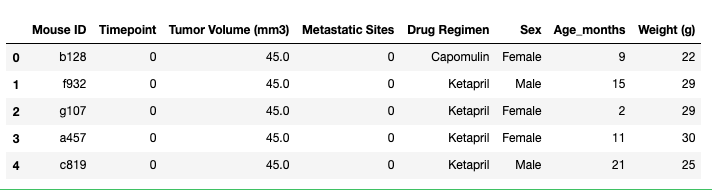
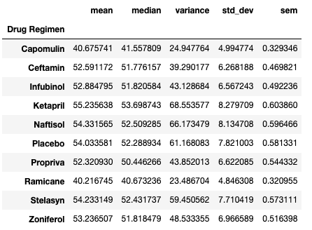
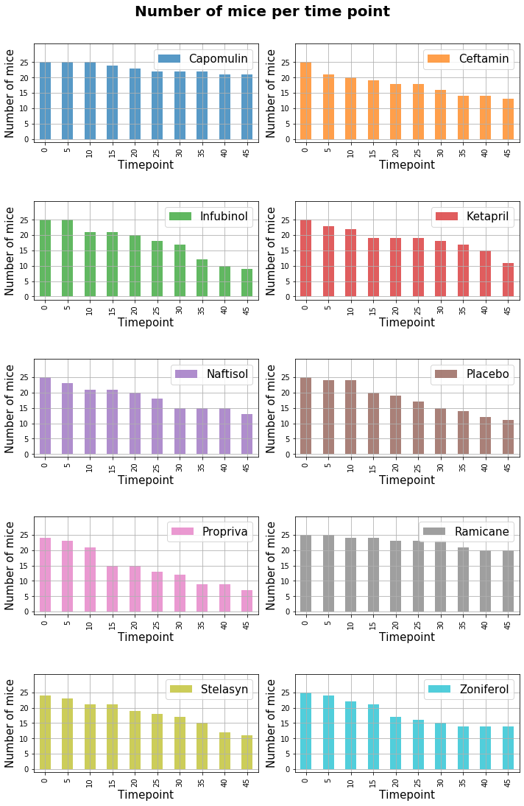
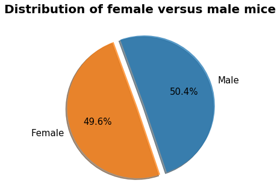

# The Power of Plots - through Matplotlib

<strong>A Data Scientist needs to be s good story teller and visualization is one of the most powerful tool to communicate a story !!!</strong>


In this project, we will analyze the data of a <strong>burgeoning pharmaceutical company that specializes in anti-cancer pharmaceuticals</strong>. In its most recent efforts, it began screening for potential treatments for squamous cell carcinoma (SCC), a commonly occurring form of skin cancer. We have the complete data from their most recent animal study, in which 249 mice identified with SCC tumor growth were treated through a variety of drug regimens. Over the course of 45 days, tumor development was observed and measured. <strong>The purpose of this study is to compare the performance of Pymaceuticals' drug of interest, Capomulin, versus the other treatment regimens. We have to generate all of the tables and figures needed for the technical report of the study, also a top-level summary of the study results.</strong> 

# Data
[1. MetaData](Pymaceuticals/data/Mouse_metadata.csv)

[2. Study Results](Pymaceuticals/data/Study_results.csv)

# Analysis


* Check the data for duplicate mice and remove any data associated with that mouse ID.
  Both the study results and metadata are merged to a single Data Frame
  The data corresponds to mouse <i>'g989'</i> has been removed as there were duplications for some of the entries.
  
  ``` python
  DF.head()
  ```
  
  ``` python
  
  DF.info()
  
  <class 'pandas.core.frame.DataFrame'>
  Int64Index: 1880 entries, 0 to 1892
  Data columns (total 8 columns):
   #   Column              Non-Null Count  Dtype  
  ---  ------              --------------  -----  
   0   Mouse ID            1880 non-null   object 
   1   Timepoint           1880 non-null   int64  
   2   Tumor Volume (mm3)  1880 non-null   float64
   3   Metastatic Sites    1880 non-null   int64  
   4   Drug Regimen        1880 non-null   object 
   5   Sex                 1880 non-null   object 
   6   Age_months          1880 non-null   int64  
   7   Weight (g)          1880 non-null   int64  
  dtypes: float64(1), int64(4), object(3)
  memory usage: 132.2+ KB
  ```

* Generate a summary statistics table consisting of the mean, median, variance, standard deviation, and SEM of the tumor volume for each drug regimen.

  ``` python
    drug_regimen_grp = DF.groupby('Drug Regimen')
    
    summary_stats = drug_regimen_grp.aggregate(mean=('Tumor Volume (mm3)', 'mean'), median=('Tumor Volume (mm3)', 'median'), variance=('Tumor Volume (mm3)', lambda x:np.var(x, ddof=1)), std_dev = ('Tumor Volume (mm3)', lambda x:np.std(x, ddof=1)), sem = (('Tumor Volume (mm3)', lambda x: st.sem(x, ddof=1))))                  

  ```
  


* Generate a bar plot using both Pandas's `DataFrame.plot()` and Matplotlib's `pyplot` that shows  the number of mice per time point for each treatment regimen throughout the course of the study.

  These plots are created using matplotlib as well as pandas plot(backend is matplotlib). Please refer the [notebook](Pymaceuticals/pymaceuticals.ipynb) for details. 
  
  
  

* Generate a pie plot using both Pandas's `DataFrame.plot()` and Matplotlib's `pyplot` that shows the distribution of female or male mice in the study.

  Here also, the plot is created using matplotlib as well as pandas plot. Please refer the [notebook](Pymaceuticals/pymaceuticals.ipynb) for details. 
  
  

* Calculate the final tumor volume of each mouse across four of the most promising treatment regimens: Capomulin, Ramicane, Infubinol, and Ceftamin. Calculate the quartiles and IQR and quantitatively determine if there are any potential outliers across all four treatment regimens.

* Using Matplotlib, generate a box and whisker plot of the final tumor volume for all four treatment regimens and highlight any potential outliers in the plot by changing their color and style.

  **Hint**: All four box plots should be within the same figure. Use this [Matplotlib documentation page](https://matplotlib.org/gallery/pyplots/boxplot_demo_pyplot.html#sphx-glr-gallery-pyplots-boxplot-demo-pyplot-py) for help with changing the style of the outliers.

* Generate a line plot of time point versus tumor volume for a single mouse treated with Capomulin.

* Generate a scatter plot of mouse weight versus average tumor volume for the Capomulin treatment regimen.

* Calculate the correlation coefficient and linear regression model between mouse weight and average tumor volume for the Capomulin treatment. Plot the linear regression model on top of the previous scatter plot.

* Look across all previously generated figures and tables and write at least three observations or inferences that can be made from the data. Include these observations at the top of notebook.

Here are some final considerations:

* You must use proper labeling of your plots, to include properties such as: plot titles, axis labels, legend labels, _x_-axis and _y_-axis limits, etc.

* See the [starter workbook](Pymaceuticals/pymaceuticals_starter.ipynb) for help on what modules to import and expected format of the notebook.

## Hints and Considerations

* Be warned: These are very challenging tasks. Be patient with yourself as you trudge through these problems. They will take time and there is no shame in fumbling along the way. Data visualization is equal parts exploration, equal parts resolution.

* You have been provided a starter notebook. Use the code comments as a reminder of steps to follow as you complete the assignment.

* Don't get bogged down in small details. Always focus on the big picture. If you can't figure out how to get a label to show up correctly, come back to it. Focus on getting the core skeleton of your notebook complete. You can always revisit old problems.

* While you are trying to complete this assignment, feel encouraged to constantly refer to Stack Overflow and the Pandas documentation. These are needed tools in every data analyst's tool belt.

* Remember, there are many ways to approach a data problem. The key is to break up your task into micro tasks. Try answering questions like:

  * How does my DataFrame need to be structured for me to have the right _x_-axis and _y_-axis?

  * How do I build a basic scatter plot?

  * How do I add a label to that scatter plot?

  * Where would the labels for that scatter plot come from?

  Again, don't let the magnitude of a programming task scare you off. Ultimately, every programming problem boils down to a handful of bite-sized tasks.

* Get help when you need it! There is never any shame in asking. But, as always, ask a _specific_ question. You'll never get a great answer to "I'm lost."

### Copyright

Trilogy Education Services © 2019. All Rights Reserved.
