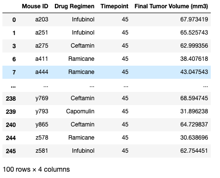
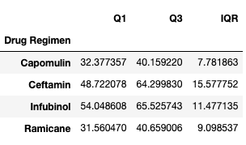
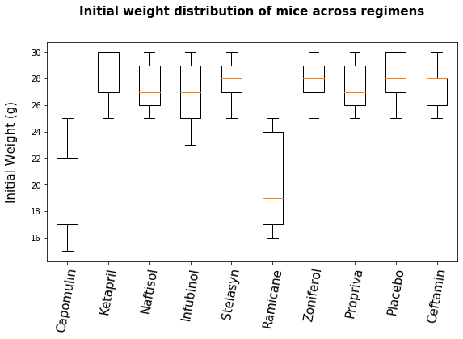

# The Power of Plots - through Matplotlib

<strong>As a Data Scientist, I  always aim to be a good story teller,  and  I believe,  visualization is one of the most powerful tool to communicate a story !!!</strong>


In this project, we will analyze the data of a <strong>burgeoning pharmaceutical company that specializes in anti-cancer pharmaceuticals</strong>. In its most recent efforts, it began screening for potential treatments for squamous cell carcinoma (SCC), a commonly occurring form of skin cancer. We have the complete data from their most recent animal study, in which 249 mice identified with SCC tumor growth were treated through a variety of drug regimens. Over the course of 45 days, tumor development was observed and measured. <strong>The purpose of this study is to compare the performance of Pymaceuticals' drug of interest, Capomulin, versus the other treatment regimens. We have to generate all of the tables and figures needed for the technical report of the study, also a top-level summary of the study results.</strong> 

# Data
[1. MetaData](Pymaceuticals/data/Mouse_metadata.csv)

[2. Study Results](Pymaceuticals/data/Study_results.csv)


# Jupyter Notebook [here](Pymaceuticals/pymaceuticals.ipynb)

# Analysis


* Check the data for duplicate mice and remove any data associated with that mouse ID.
  Both the study results and metadata are merged to a single Data Frame
  The data corresponds to mouse <i>'g989'</i> has been removed as there were duplications for some of the entries.
  
  ``` python
  DF.head()
  ```
  
  ``` python
  
  DF.info()
  
  <class 'pandas.core.frame.DataFrame'>
  Int64Index: 1880 entries, 0 to 1892
  Data columns (total 8 columns):
   #   Column              Non-Null Count  Dtype  
  ---  ------              --------------  -----  
   0   Mouse ID            1880 non-null   object 
   1   Timepoint           1880 non-null   int64  
   2   Tumor Volume (mm3)  1880 non-null   float64
   3   Metastatic Sites    1880 non-null   int64  
   4   Drug Regimen        1880 non-null   object 
   5   Sex                 1880 non-null   object 
   6   Age_months          1880 non-null   int64  
   7   Weight (g)          1880 non-null   int64  
  dtypes: float64(1), int64(4), object(3)
  memory usage: 132.2+ KB
  ```

* Generate a summary statistics table consisting of the mean, median, variance, standard deviation, and SEM of the tumor volume for each drug regimen.

  ``` python
    drug_regimen_grp = DF.groupby('Drug Regimen')
    
    summary_stats = drug_regimen_grp.aggregate(mean=('Tumor Volume (mm3)', 'mean'), median=('Tumor Volume (mm3)', 'median'), variance=('Tumor Volume (mm3)', lambda x:np.var(x, ddof=1)), std_dev = ('Tumor Volume (mm3)', lambda x:np.std(x, ddof=1)), sem = (('Tumor Volume (mm3)', lambda x: st.sem(x, ddof=1))))                  

  ```
  


* Generate a bar plot using both Pandas's `DataFrame.plot()` and Matplotlib's `pyplot` that shows  the number of mice per time point for each treatment regimen throughout the course of the study.

  These plots are created using matplotlib as well as pandas plot(backend is matplotlib). Please refer the [notebook](Pymaceuticals/pymaceuticals.ipynb) for details. 
  
  
  

* Generate a pie plot using both Pandas's `DataFrame.plot()` and Matplotlib's `pyplot` that shows the distribution of female or male mice in the study.

  Here also, the plot is created using matplotlib as well as pandas plot. Please refer the [notebook](Pymaceuticals/pymaceuticals.ipynb) for details. 
  
  

* Calculate the final tumor volume of each mouse across four of the most promising treatment regimens: Capomulin, Ramicane, Infubinol, and Ceftamin. Calculate the quartiles and IQR and quantitatively determine if there are any potential outliers across all four treatment regimens.

  ``` diff
  Final tumor volume of each mouse across four of the most promising treatment regimens [Capomulin, Ramicane, Infubinol, Ceftamin]
  ```
  
  
  ``` diff
  IQR of final tumor volumes of mice for the regimes [Capomulin, Ramicane, Infubinol, Ceftamin]
  ```
  
  
  ``` diff
  Display of any outlier in the regimes [Capomulin, Ramicane, Infubinol, Ceftamin]
  ```
  
    
  ``` diff
  - Though it looks like, Mouse c326 shows tremendous improvement compared to other mice treated with Infubinol, 
  - the fact is, c326 appears to be died within 5 days after significant reduction of tumor size
  ```
* Using Matplotlib, generate a box and whisker plot of the final tumor volume for all four treatment regimens and highlight any potential outliers in the plot by changing their color and style.
  
  ``` python
  #Now, create a dictionary with keys = regime names and value as list of Final Tumor Volume (mm3). Easy peasy with dictionary comprehension !!
  Dict_Regime_Final_Tumor_Volume = {regime:Final_Tumor_Volume_MPDR_sel[Final_Tumor_Volume_MPDR_sel['Drug Regimen']==regime]     ['Final Tumor Volume (mm3)'].to_list() for regime in Final_Tumor_Volume_MPDR_sel['Drug Regimen'].unique()} 
  #Diplay this dictionary as DataFrame
  pd.DataFrame(Dict_Regime_Final_Tumor_Volume).head(5)
  ```
  
  
  
  
  
  ``` diff
  - As we have seen earlier in outlier analysis, there is an outlier (mouse c326) which shows 
  - tremendous improvement compared to other mice trated with Infubinol
  ```
  
  Used this [Matplotlib documentation page](https://matplotlib.org/gallery/pyplots/boxplot_demo_pyplot.html#sphx-glr-gallery-pyplots-boxplot-demo-pyplot-py) to change the style of the outliers.

* Generate a line plot of time point versus tumor volume for a single mouse treated with Capomulin.
  
  A Capomulin treated mouse is chosen randomly - 'I897'
  
  
  
  

* Generate a scatter plot of mouse weight versus average tumor volume for the Capomulin treatment regimen.

  Below dataframe and corresponding scatter plot summarize mouse weight and average tumor volume for the Capomulin regimen
  
  
  
  
  

* Calculate the correlation coefficient and linear regression model between mouse weight and average tumor volume for the Capomulin treatment. Plot the linear regression model on top of the previous scatter plot.

  ```diff
  + The correlation between weight and avg. tumor size is 0.95
  ```
  


# Observations and inferences

* **Which are the regimens showing improvements ?**
  <br>**ONLY Capomulin and Ramicane are showing improvements in tumor sizes**. On day one, all the mice had a tumor size of 45 g. After 45 days, the average tumor size in Capomulin is 36.23 and in Ramicane, it is 34.95, while, in all other regimen, the average tumor sizes are more than 45. **Metastatic states (secondary spots to which tumour spreads)** are a measure of severity of tumor. Initially (day 0), all the mice had no metastatic states. However, during the course of 45 days, metastatic states increased. Again, **Capomulin and Ramicane are the regimen with the least average metastatic states** (1.48 and 1.25 respectively) compared to other regimen.
  
  
  
   <br>
  
  
   <br>
  
* **Which are the treatments relatively safe** ?
  <br>Some tumor treatments are known to be risky and cost lives. So we, need to ensure that, they are not reducing the tumor size (in avg), not at the cost of taking lives. Initially, all the regimen had either 25 or 24 mice. During the course of the treatment, atleast some mice died in all the regimen. Again, **Capomulin and Ramicane are significantly better** in terms of taking less lives (4 and 5 respectively!) compared to others. Need to mention that **Propriva is the worst, as it took 17 lives, which is a whopping 71%**
  
  
   <br>
* We could see a **strong positive correlation (0.95) between weight and avg. tumor size.(Refer [this](Images/graph6.png))** This has to be read as follows; **tumor size reduces at the cost of weight!** This might be because of the harsh chemicals involved in the treatment. Except Ceftamin, all other treatments resulted in the reduction of average body weights; and the identified best treatments Capomulin(1.31%) and Ramicane (3.50%) belong to the top 3 highest reductions accompanying Infubinol (2.39%)

  
  <br>
* **There is bias in the experiment!!!** 
<br>Usually comparison experiments are conducted with same environment for all. In this study, all the regimen had mice of almost equal number (25 or 24), all the mice had exactly same initial body weight. However, the initial average body weights in the regimen do not tally. **The top performing regimen Capomulin and Ramicane have significantly less initial(day 0) average body weights (20 and 20.12 respectively; not only the avg. but also the distribution) compared to that of other regimens. The reason for this needs to be clarified with Research Teams (who conducted this study)**

  

